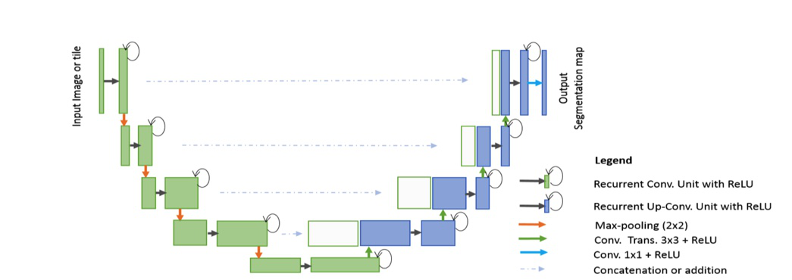

# R2U-Net : Medical Image Segmentation
 
## Introduction 

In this repository, we implement the R2U-Net network with the [Paddle](https://www.paddlepaddle.org.cn/) framework. Our model achieves F1-score 0.8234 on DRIVE dataset.  

- Original Paper : [Recurrent Residual Convolutional NeuralNetwork based on U-Net (R2U-Net) for Medical Image Segmentation](https://arxiv.org/pdf/1802.06955.pdf)  
- Dataset : [DRIVE](https://drive.grand-challenge.org)  

## R2U-Net

  

## Reprod log

- [forward_diff.log](./diff/forward_diff.log)  
- [metric_diff.log](./diff/metric_diff.log)  
- [loss_diff.log](./diff/loss_diff.log) 
- [bp_align_diff.log](./diff/bp_align_diff.log)  
- [train_align_diff.log](./diff/train_align_diff.log)  
- [train log](./diff/train.log) 

## Train & Test

To train the model yourself, run :  
```
python main.py --model R2U-Net --mode train 
```
To test the results with the model we provided :
```
python main.py --model R2U-Net --mode test
```  
Other Parameters:  
`--dataset_path` : path to dataset  
`--result_path` : path to save results  
`--epoch` : training epochs  
`--batch_size`: batch size  
`--lr` : learning rate  
`--show` : show the testing results (default: False)

## AI studio link

* [https://aistudio.baidu.com/aistudio/projectdetail/2547405](https://aistudio.baidu.com/aistudio/projectdetail/2547405)


